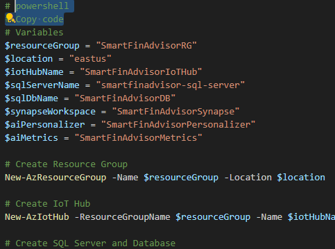

# Smart Financial Advisor for Personalized Wealth Management

## Project Description
**Core Idea:**
The Smart Financial Advisor project addresses the challenge of personalized financial management by leveraging AI and cloud services to offer tailored financial advice. Our solution will analyze users' financial data and provide actionable insights to optimize their investment strategies, savings plans, and overall financial health.

**Problem and Solution:**
Many people find it difficult to navigate the complexities of personal finance without professional guidance, which can be costly and inaccessible. By utilizing Azure's advanced analytics and AI capabilities, our Smart Financial Advisor will deliver customized financial recommendations, helping users make informed decisions about budgeting, investing, and saving.

**Addressing Needs and Opportunities:**
This project addresses the need for accessible, personalized financial advice, filling the gap left by traditional financial advisory services. By providing real-time financial insights and recommendations, users can improve their financial literacy and make smarter financial decisions. The solution is clearly aligned with the problem statement, offering an innovative approach to personal finance management.

## Key Features
1. **Personalized Financial Insights:** Using Azure AI to analyze users' financial data and provide customized advice on budgeting, saving, and investing.
2. **Investment Optimization:** Leveraging Azure Synapse Analytics to assess market trends and optimize users' investment portfolios.
3. **Budget Tracking and Alerts:** Integrating with Azure IoT Hub to track spending habits and send real-time alerts for budget deviations.
4. **Goal Setting and Progress Monitoring:** Helping users set financial goals and monitor progress using Azure AI Metrics Advisor.
5. **Data Security and Compliance:** Ensuring data privacy and compliance with financial regulations using Azure Key Vault and Azure Security Center.

## Core Azure Services
1. **Azure Synapse Analytics**
2. **Azure IoT Hub**
3. **Azure SQL Database**

## Azure AI Services
1. **Azure AI Personalizer**
2. **Azure AI Metrics Advisor**

## Other Azure Technologies
Azure Logic Apps for workflow automation, Azure Key Vault for managing sensitive data, and Azure DevOps for continuous integration and deployment.

## Deployment Methods
You can deploy the project using any of the following methods:
- Azure Portal
- Azure Command-Line Interface (CLI)
- PowerShell
- Visual Studio Code (Azure Extensions)
- Visual Studio (Azure Development Tools)

## Interconnectivity between Services
The interaction between Azure services is essential for the functionality of the Smart Financial Advisor. Below is an illustration of how these services communicate:
- **Azure Synapse Analytics** processes and analyzes financial data.
- **Azure IoT Hub** collects real-time spending data from user devices.
- **Azure SQL Database** stores user financial information.
- **Azure AI Personalizer** and **Azure AI Metrics Advisor** provide customized financial advice and monitor goal progress.

## Deployment Steps
1. **Azure Portal:**
   - [ ] Create and configure Azure Synapse Analytics workspace.
   - [ ] Set up Azure IoT Hub and connect devices.
   - [ ] Deploy Azure SQL Database and configure schema.
   - [ ] Configure Azure AI Personalizer and Metrics Advisor.

2. **CLI / PowerShell / VS Code:**
   - [ ] Use CLI/PowerShell scripts to automate resource creation.
   - [ ] Deploy resources using VS Code Azure extensions.

## Screenshots of Deployment

<!--  -->
<!--  -->

## Project Demo Video URL
[Project Demo Video](https://yourvideolink.com)

## License
[MIT License](LICENSE)
